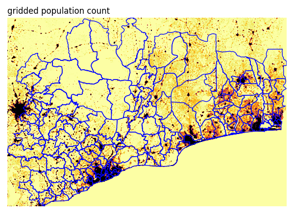
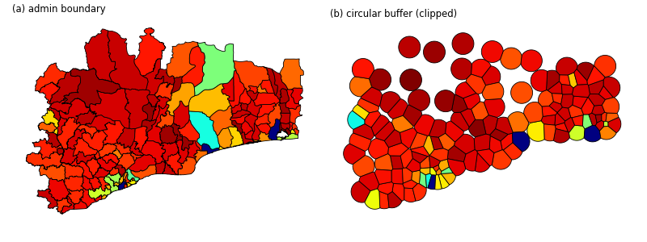

# Get WorldPop Global Demographic Data

This repository contains some Python functions for the following purposes:
- to locate and download Worldpop Global Demographic Data in raster format. The data can be in country-wise format or global mosaic.
- to acquire and summarise population count from the WorldPop Global Demographic Data.

## Download rasters
```python
usage: get_raster [-h] [-l LAYER] [-t TLC]
                  [-d DATASET] [-v VERSION] [-y YEAR]
                  [-ar AGE_RANGE] [-dst DESTINATION]
                  [-c | --check | --no-check]

Simple program to download the Worldpop GlobalDemographic Data to local storage.

optional arguments:
  -h, --help            show this help message and exit
  -l LAYER, --layer LAYER
                        selected layer to download [pop,
                        female, male, zip]
  -t TLC, --tlc TLC     three letter code of the country to
                        download
  -d DATASET, --dataset DATASET
                        dataset number
  -v VERSION, --version VERSION
                        version number
  -y YEAR, --year YEAR  year
  -ar AGE_RANGE, --age_range AGE_RANGE
                        min and max age group to download,
                        separated by comma
  -dst DESTINATION, --destination DESTINATION
                        destination folder
  -c, --check, --no-check
                        list urls without downloading
                        (default: False)
```

There are some use cases with different raster targets:
- A global mosaic of population in 2020 (1-km resolution): `python get_raster.py -l pop -t MOS -y 2020 -dst output`
- A raster of 100-m resolution population of Aruba (tlc=ABW) in 2020: `python get_raster.py -l pop -t ABW -y 2020 -dst output -res 100m`
- Rasters of 1-km resolution female population (age 0-20) of Aruba in 2020: `python get_raster.py -t ABW -l female -ar 0,20 -y 2020 -res 1km -dst output`
- A zip file containing rasters of 1-km resolution male and female population (all age groups) of Aruba in 2020: `python get_raster.py -l zip -t ABW -y 2020 -res 1km -dst output`

### Notes
Acceptable values for the options:
| option | possible values |
| --- | --- |
| layer | `pop`, `female`, `male`, `zip` |
| tlc | valid TLC/Alpha-3 or `MOS` for global mosaic or `ALL` for all countries |
| year | `2015` to `2030` |
| res | `100m` or `1km` |
| age_range | `0` to `90` |


## Acquire and summarise
The idea is to get population count in every unit with boundary defined in the input. To achieve this, the function reads vector data defining the region of interests and performs zonal statistics to the relevant raster.

### Preparation
VRT file is used as the reference to multiple rasters in the dataset. `prep_script.py` can be used to create relevant VRT files and put them in `vrt` folder. Modify `dataset` value when needed.

In python console, we can run:
```python
exec(open('prep_script.py').read())
```

### Usage
#### Population count
Obtaining population count inside non-overlapping circular buffers around points defined in `adm.pkg`.

```python
import get_table as wp

vrt_path = 'vrt/R2024B/mosaic_2020_100m_constrained.vrt'
result = wp.extract('adm.gpkg', vrt_path=vrt_path,
    rad=10, clip_buffer=True,
    return_gdf=True)

# Alternative usage
result1 = wp.get_data('adm.gpkg', dataset='R2024B', 
    year=2020, resolution='1km', vrt_dir='vrt',
    return_gdf=True, rad=5, clip_buffer=False)
```

#### Age-sex structure
Extracting female population count with specified age range can be done using `get_data_agesex()`. The output contains population count at 5-year age interval. Total population count can also be extracted. This total covers the whole population, both sexes and all age intervals.

```python
import get_table as wp

result2 = wp.get_data_agesex('adm.geojson', dataset='R2024B', 
    year=2020, resolution='1km', 
    vrt_dir='vrt', sex='female', get_total=True,
    return_gdf=False)

result2.head()
```

|    |   id |  f_00 |  f_05 |  f_10 |     pop |
|---:|-----:|------:|------:|------:|--------:|
|  0 |    0 | 18161 | 76259 | 65505 | 1087010 |
|  1 |    1 |  2291 |  9623 |  8266 |  137168 |
|  2 |    2 |  1428 |  5996 |  5151 |   85479 |
|  3 |    3 |  4200 | 17637 | 15150 |  251403 |
|  4 |    4 |   296 |  1244 |  1068 |   17732 |

#### Some visualisations

Extracting gridded population count based on level-2 administrative boundaries covering some parts of Ghana, Benin, and Togo. Zonal statistics can be performed to obtain total population inside each administrative unit.



Extraction of total population using admin boundary (a) and circular buffer (b). The circular buffer is generated from the centroid of each administrative unit, which then clipped to avoid overlap.

